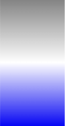
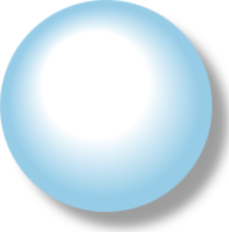

### canvas스타일 적용하기



### 활용예제1

```html
<!DOCTYPE html>
<html lang="en">
  <head>
    <meta charset="UTF-8" />
    <meta name="viewport" content="width=device-width, initial-scale=1.0" />
    <title>Canvas</title>
    <style>
      * {
        margin: 0;
        padding: 0;
        overflow: hidden;
      }
    </style>
  </head>
  <body>
    <canvas width="800" height="600"></canvas>
    <script>
      const canvas = document.querySelector("canvas");
      const ctx = canvas.getContext("2d");

      let linGrad = ctx.createLinearGradient(0, 0, 0, 200); // (x0, y0, x1, y1)
      linGrad.addColorStop(0, "gray");
      linGrad.addColorStop(0.5, "white");
      linGrad.addColorStop(1, "blue");
      ctx.fillStyle = linGrad;
      ctx.fillRect(0, 0, 100, 200); // (x, y, width, height) 사각형 만드는 규칙
    </script>
  </body>
</html>
```

### 활용예제2



```html
<!DOCTYPE html>
<html lang="en">
  <head>
    <meta charset="UTF-8" />
    <meta name="viewport" content="width=device-width, initial-scale=1.0" />
    <title>Canvas</title>
    <style>
      * {
        margin: 0;
        padding: 0;
        overflow: hidden;
      }
    </style>
  </head>
  <body>
    <canvas width="800" height="600"></canvas>
    <script>
      const canvas = document.querySelector("canvas");
      const ctx = canvas.getContext("2d");

      // 원형 그라디언트 생성
      let radGrad = ctx.createRadialGradient(90, 80, 50, 100, 100, 100); // (x0, y0, r0, x1, y1, r1)
      radGrad.addColorStop(0, "white");
      radGrad.addColorStop(0.8, "skyblue");
      radGrad.addColorStop(1, "skyblue");

      ctx.shadowColor = "rgba(10,10,10,0.4)";
      ctx.shadowBlur = 10;
      ctx.shadowOffsetX = 15;
      ctx.shadowOffsetY = 15;
      ctx.fillStyle = radGrad;
      ctx.beginPath();
      ctx.arc(100, 100, 100, 0, Math.PI * 2, false);
      ctx.fill(); // 채우기
    </script>
  </body>
</html>
```
