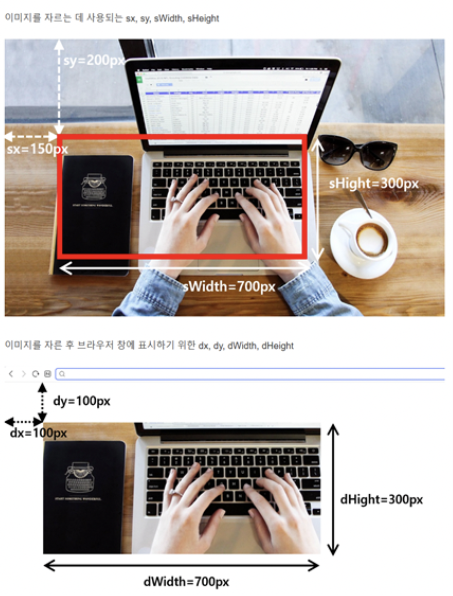

# canvas 이미지



## 활용예제1

### HTML

```html
<!DOCTYPE html>
<html lang="en">
  <head>
    <meta charset="UTF-8" />
    <meta name="viewport" content="width=device-width, initial-scale=1.0" />
    <title>Canvas</title>
    <style>
      * {
        margin: 0;
        padding: 0;
      }
      canvas {
        border: 1px solid #000;
      }
    </style>
  </head>
  <body>
    <canvas width="300" height="300"></canvas>
    <!--  -->
    <script>
      const canvas = document.querySelector("canvas");
      const ctx = canvas.getContext("2d");

      let img = new Image("");
      img.onload = function () {
        ctx.drawImage(img, 0, 0, canvas.width, canvas.he);
        ctx.drawImage(img, 300, 300, 1500, 1000, 0, 0, 1000, 500);
      };
      img.src = "./img/apple.jpeg";
      ctx.beginPath();
      ctx.arc(100, 150, 70, 0, Math.PI * 2, false);
      ctx.clip();
    </script>
  </body>
</html>
```

### 활용예제2\_텍스트안에 이미지

```html
<!DOCTYPE html>
<html lang="en">
  <head>
    <meta charset="UTF-8" />
    <meta name="viewport" content="width=device-width, initial-scale=1.0" />
    <title>Canvas</title>
    <style>
      * {
        margin: 0;
        padding: 0;
        overflow: hidden;
      }

      canvas {
        border: 1px solid #000;
      }
    </style>
  </head>
  <body>
    <canvas width="800" height="600"></canvas>
    <script>
      const canvas = document.querySelector("canvas");
      const ctx = canvas.getContext("2d");

      ctx.font = "bold 200px sans-serif";
      ctx.fillText("GOOD", 50, 200);
      ctx.beginPath();
      ctx.globalCompositeOperation = "source-in";
      let img = new Image();
      img.onload = function () {
        ctx.drawImage(img, 0, 0, canvas.width, canvas.height);
      };
      img.src = "./img/apple.jpeg";
    </script>
  </body>
</html>
```
