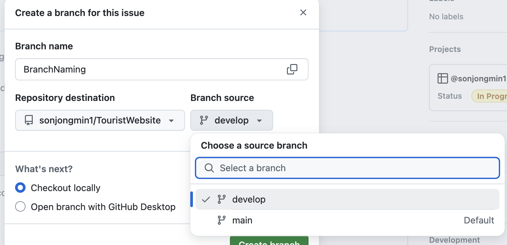
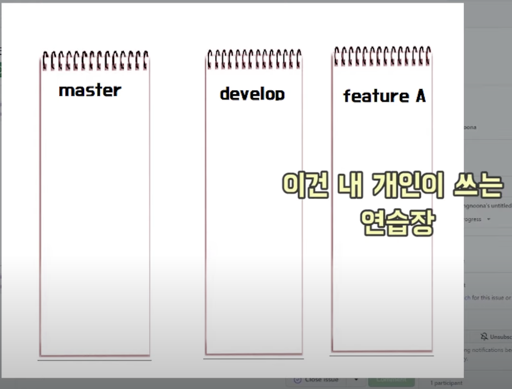
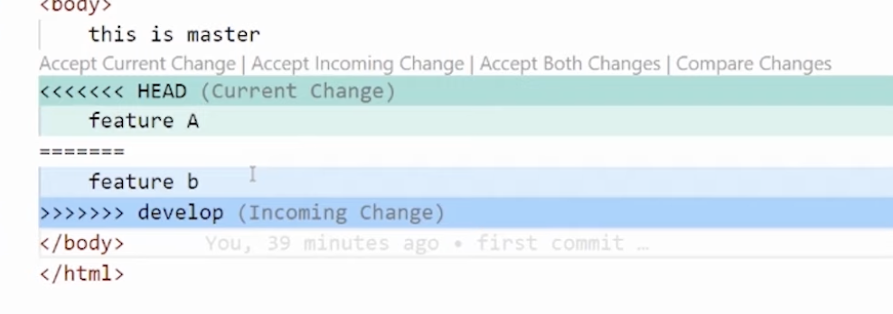

# `협업방법`

## Master

## `1. 깃허브 repository 만들기`

## `2. 팀원들 초대하기`


- Invite collaborators

## `3. 프로젝트 만들기`

```js
git init git add .
git commit -m "first commit"
git remote ... git push origin main
```

- 주의사항: 기본 branch값이 master일 경우

#### 로컬 브랜치 이름 변경

- git branch -m master main

#### 변경된 브랜치 깃허브에 보내주기

- git push origin main 브랜치

#### Default branch main으로 변경 및 마스터 브랜치 삭제


- git push origin --delete master

---

## `4. Develop 브랜치 만들기`

- 개발자가 자유롭게 개발하는 브랜치
- 코드들이 완벽하게 정리되면은 develop 브랜치에서 main으로 보내준다.

#### 브랜치만들기

```js
git checkout -b develop
```

```js
git push
```

- push 하게되면 git push --set-upstream origin develop 라는 문구가 뜬다. develop이라는 브랜치 자체가 깃허브에 안만들어져 있다는 뜻이다.

#### 아래 코드를 입력하여 로컬에서 만든 develop 브랜치를 깃허브에 만들어주자

```js
git push --set-upstream origin develop
```

---

### main 브랜치에 함부로 코드를 push하고 수정할 수 없게 막아야함

## `5. master 브랜치 보호하기`

- Settings > Branches > Add branch ruleset

5-1. Ruleset Name 이름 설정
예: Master Branch Protection<br>
이름은 프로젝트나 브랜치를 명확히 구분할 수 있도록 설정

5-2. Enforcement Status (적용 상태)

- Enforcement Status: 활성화 여부를 결정합니다.
- 활성화 상태로 설정해야 규칙이 적용됩니다.
- 비활성화 시 설정만 저장되고 실제로 적용되지 않습니다.

5-3. Bypass List

- 특정 사용자, 팀, 역할이 규칙을 무시하도록 설정할 수 있습니다.
- 예를 들어 관리자나 DevOps 팀을 추가하면, 그들은 규칙을 우회할 수 있습니다.
- 기본적으로 비어 있는 상태를 유지하면 모든 사용자가 규칙을 따라야 합니다.

---

### 5-4. Target Branches (대상 브랜치 설정)

### Include default branch

- 기능: 기본 브랜치(예: master 또는 main)에 보호 규칙을 자동으로 적용합니다.
- 추천 상황: master 또는 main 브랜치를 보호하려는 경우 이 옵션을 선택하세요
  - 이 경우, 별도의 패턴 입력 없이 기본 브랜치에 규칙이 적용됩니다.

---

- Branch Targeting: 보호 규칙을 적용할 브랜치를 지정합니다.
  - 대상 브랜치를 **master**로 설정하세요.
    - 예: master, main
- 여러 브랜치에 동일한 규칙을 적용하고 싶다면 패턴을 사용하세요.
  - 예: release/_, hotfix/_

---

5-5. Branch Rules 설정

- 팀원들이 master 브랜치에 자유롭게 푸시하지 못하도록 세부 규칙을 설정합니다.

### 최소 설정 권장

- 1. Require a pull request before merging: 필수 활성화.
- 2. Block force pushes: 필수 활성화.
- 3. Restrict deletions: 활성화.
- 4. (선택) Require status checks to pass: CI/CD와 연동한다면 활성화.


---

## `6. 깃허브보드 브랜치 만들기`

- 1. Convert to issue > Create a branch
- 2. 반드시 Branch source를 develop에서 가져와야한다. 하기 사진과 같이 Branch source 반드시 경로변경
     



- 3. 생성된 명령어 복사, 붙여넣기

```js
git fetch origin
git checkout 작명한브랜치네이밍
```

---

# `Developer`

## `1. 프로젝트 클론하기`

터미널

```js
cd Desktop
git clone 클론주소 프로젝트명
```

- 1-1. 먼저 원본 프로젝트를 클론한다.
- 1-2. 깃허브보드에 브랜치 가져온다.
- 1-3. 반드시 브랜치소스 develop 설정

```js
git fetch origin
git checkout 작명한브랜치네이밍
```

### 각자의 브랜치에 코드를 완성하면 `git push` 하여 각자의 브랜치에 올린다.

### 작성된 코드는 develop으로 보내준다.

### `풀 리퀘스트(PR) 만들기`

base : develop, compare: 브랜치명<br>
브랜치로부터 마스터로 보낸다.

### 팀원들은 Pull requests > Files changed > Finish your review > 확인 후 이상없으면 Approve, 코드 심각하면 Request changes(코드 다시 작성토록 재요청, Request changes하게되면 다시 Request changes한 팀원한테 재승인 받아야된다.)

- comment 받은 팀원은 코드 수정 후
- git add .
- git commit -m "add"
- git push

`confirm을 다 받은 팀원은 자기가 올린 소스를 최종 Merge pull request한다.`

---

# `깃 충돌 상황`

다른 팀원이 파일을 업데이트하고 동일 페이지에서 작업하는 팀원이랑 겹쳤을때 충돌발생

- git add .
- git commit -m "add"
- git push
- 풀리퀘스트(PR), Pull Request(풀 리퀘스트)는 다른 브랜치로 변경 사항을 전송하는 작업에서 충돌 발생을 확인했으면, command line 명령어를 사용해서 충돌을 해결한다.

1. develop 브랜치로 이동

```js
git checkout develop
```

2. develop 바뀐 내용가져오기

```js
git pull origin develop
```

3. 다시 내 브렌치로 돌아가기

```js
git checkout 내브랜치명 //또는
git checkout - // -는 이전으로 이동한다는 뜻이다.

```

4. 나의 브랜치에서 develop의 코드들을 합친다. 합치는 작업을 develop에 가서하게되면 다른개발자들도 받아쓰고 있기때문에 난리가난다. 그러므로 나의 브랜치에서 develop 코드를 합친다.

```js
git merge develop // develop브랜치와 합친다, 현재 경로는 나의 브랜치
```

5. 팀원과 충돌한 부분이 코드에 나온다. 팀원들과 의논 후 충돌 된 코드 오류부분 확인 후 알맞은 코드 선택
   

6. 수정 후 코드가 실행되는지 라이브서버, 브라우저를 통해 재확인

7. 완성된 코드 다시 올리기

```js
git add .
git commit -m "add"
git push
```

8. 팀원들이 코드 검토 후 approve > 작성자 Merge pull request > Confirm merge

9. 완료한 브렌치는 깃허브보드에 Done으로 옮겨놓기

---

# `develop에서 master로 배포하기`

1. 팀원들 approve
2. Merge pull request > Confirm merge
