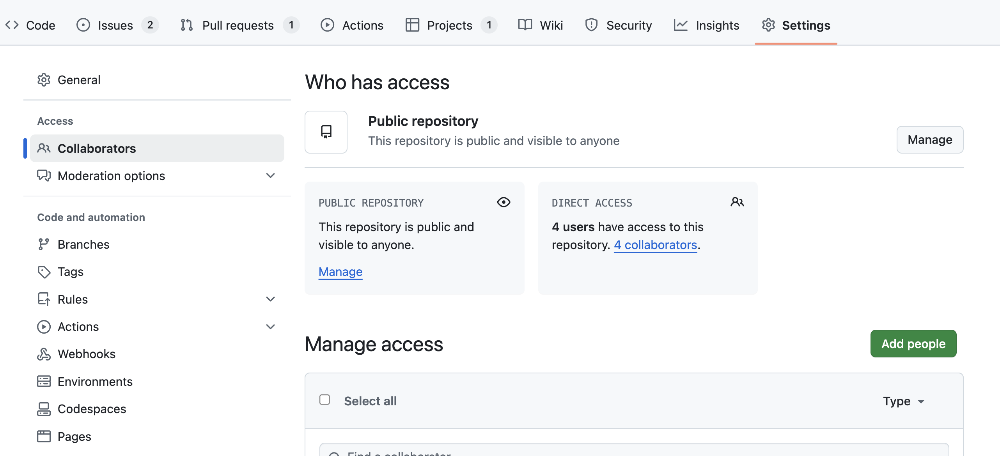
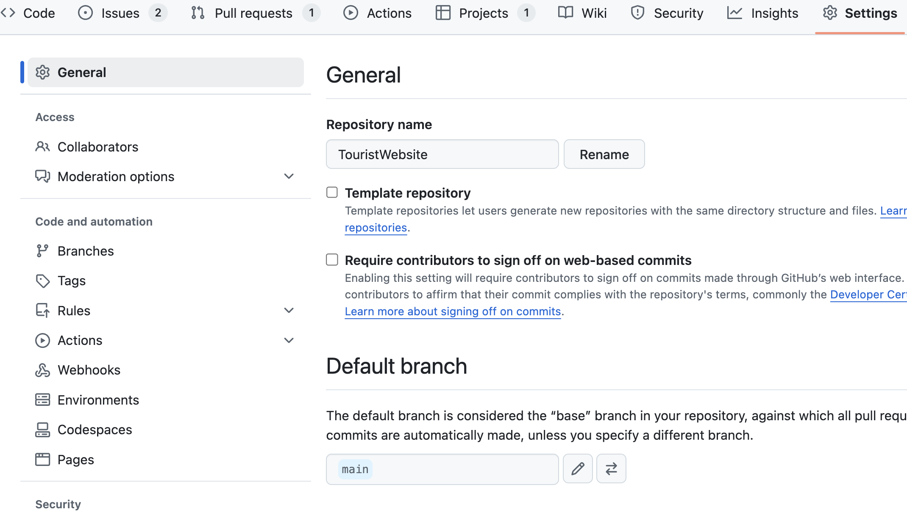
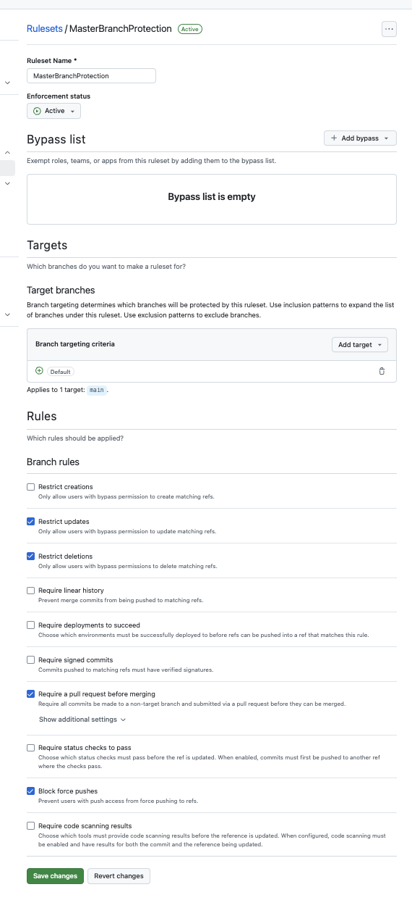

# `협업방법`

## Master

### 1. 깃허브 repository 만들기

### 2. 팀원들 초대하기



- Invite collaborators

### 3. 프로젝트 만들기

```js
git init git add .
git commit -m "first commit"
git remote ... git push origin main
```

- 주의사항: 기본 branch값이 master일 경우

#### 로컬 브랜치 이름 변경

- git branch -m master main

#### 변경된 브랜치 깃허브에 보내주기

- git push origin main 브랜치

#### Default branch main으로 변경 및 마스터 브랜치 삭제



- git push origin --delete master

---

### 4. Develop 브랜치 만들기

- 개발자가 자유롭게 개발하는 브랜치
- 코드들이 완벽하게 정리되면은 develop 브랜치에서 main으로 보내준다.

#### 브랜치만들기

```js
git checkout -b develop
```

```js
git push
```

- push 하게되면 git push --set-upstream origin develop 라는 문구가 뜬다. develop이라는 브랜치 자체가 깃허브에 안만들어져 있다는 뜻이다.

#### 아래 코드를 입력하여 로컬에서 만든 develop 브랜치를 깃허브에 만들어주자

```js
git push --set-upstream origin develop
```

---

### main 브랜치에 함부로 코드를 push하고 수정할 수 없게 막아야함

### 5. master 브랜치 보호하기

- Settings > Branches > Add branch ruleset

1. Ruleset Name 이름 설정
   예: Master Branch Protection<br>
   이름은 프로젝트나 브랜치를 명확히 구분할 수 있도록 설정

2. Enforcement Status (적용 상태)

- Enforcement Status: 활성화 여부를 결정합니다.
- 활성화 상태로 설정해야 규칙이 적용됩니다.
- 비활성화 시 설정만 저장되고 실제로 적용되지 않습니다.

3. Bypass List

- 특정 사용자, 팀, 역할이 규칙을 무시하도록 설정할 수 있습니다.
- 예를 들어 관리자나 DevOps 팀을 추가하면, 그들은 규칙을 우회할 수 있습니다.
- 기본적으로 비어 있는 상태를 유지하면 모든 사용자가 규칙을 따라야 합니다.

---

### 4. Target Branches (대상 브랜치 설정)

### Include default branch

- 기능: 기본 브랜치(예: master 또는 main)에 보호 규칙을 자동으로 적용합니다.
- 추천 상황: master 또는 main 브랜치를 보호하려는 경우 이 옵션을 선택하세요
  - 이 경우, 별도의 패턴 입력 없이 기본 브랜치에 규칙이 적용됩니다.

---

- Branch Targeting: 보호 규칙을 적용할 브랜치를 지정합니다.
  - 대상 브랜치를 **master**로 설정하세요.
    - 예: master, main
- 여러 브랜치에 동일한 규칙을 적용하고 싶다면 패턴을 사용하세요.
  - 예: release/_, hotfix/_

---

5. Branch Rules 설정

- 팀원들이 master 브랜치에 자유롭게 푸시하지 못하도록 세부 규칙을 설정합니다.

### 최소 설정 권장

- 1. Require a pull request before merging: 필수 활성화.
- 2. Block force pushes: 필수 활성화.
- 3. Restrict deletions: 활성화.
- 4. (선택) Require status checks to pass: CI/CD와 연동한다면 활성화.


