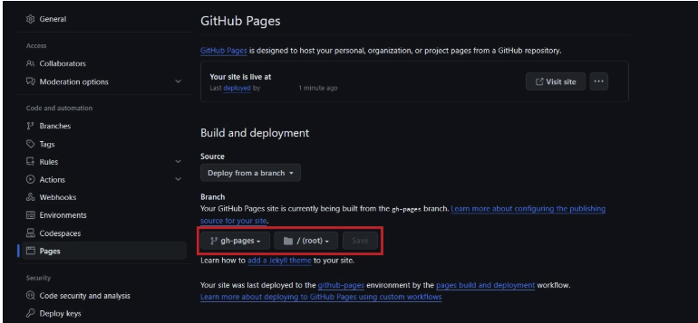

# React 홈페이지 링크 생성방법

### 순서

```js
# 1. Git 초기화 (필요 시)
git init

# 2. gh-pages 설치
npm install gh-pages

# 3. package.json 수정
 "homepage": "https://sonjongmin1.github.io/리파지토리이름/",
 "scripts": {
   "predeploy": "npm run build",
   "deploy": "gh-pages -d build"
 }

# 4. 파일 추가 후 커밋
git add .
git commit -m "Initial commit"

# 5. 원격 저장소 연결 및 푸시
git remote add origin https://github.com/[사용자명]/[리포지토리 이름].git
git branch -M master
git push -u origin master

# 6. 배포 실행 (npm run deploy를 실행하면 자동으로 npm run build가 먼저 실행된다.)
npm run deploy
```

---

### 설명

### 1. React 프로젝트를 배포하려면 gh-pages 패키지를 설치해야 합니다.

```js
npm install gh-pages
```

### 2. 패키지를 설치한 후 package.json 파일의 scripts 부분을 다음과 같이 수정

```js
"scripts": {
    "predeploy": "npm run build",
    "deploy": "gh-pages -d build"
}
```

### 3. homepage 항목을 만들어 호스팅 웹 사이트 주소를 입력

```js
"homepage": "https://GitHub아이디.github.io/Repository명/"
```

### 4. 수정된 코드를 Repository에 업로드한 후 npm run deploy 명령어를 실행

```js
npm run deploy
```

### 5. GitHub Pages 설정으로 돌아가서 새로운 gh-pages 브랜치가 생성되었는지 확인하고 Save 버튼을 클릭



### 6. 보내기

```js
git init
npm run build
git add .
git commit -m "커밋이름"
git push origin master
```
