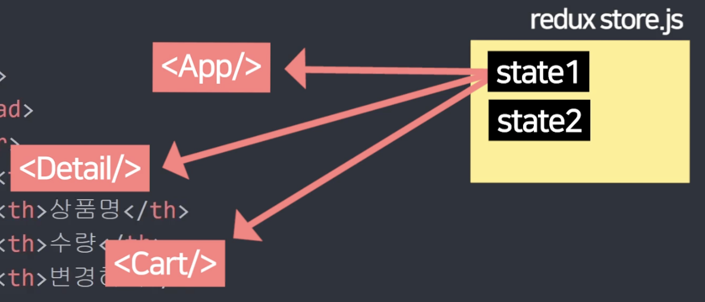

# `Redux`

### Redux를 사용하면 컴포넌트들이 props 없이 state 공유가능



### Redux 설치

```js
npm install @reduxjs/toolkit@1.8.1 react-redux
```

## Setting

### 1. store.js 파일생성

#### store.js

```js
import { configureStore } from "@reduxjs/toolkit";

export default configureStore({
  reducer: {},
});
```

### 2. index.js 또는 main.jsx가서 \<Provider store={store}> 쓰기

#### index.js || main.jsx

```js
import { StrictMode } from "react";
import { createRoot } from "react-dom/client";
import "./index.css";
import App from "./App.jsx";
import { BrowserRouter } from "react-router-dom";
import { Provider } from "react-redux";
import store from "./stor.js";

createRoot(document.getElementById("root")).render(
  <StrictMode>
    <Provider store={store}>
      <BrowserRouter>
        <App />
      </BrowserRouter>
    </Provider>
  </StrictMode>
);
```

- App이라는 컴포넌트와 모든 자식들은 store에 있던 state 전부 사용가능

### Redux는 컴포넌트간 state 공유가 편해지기때문에 사용한다.

### Redux 활용

#### store.js

```js
import { configureStore, createSlice } from "@reduxjs/toolkit";

// useState() 역할
let user = createSlice({
  name: "user",
  initialState: "kim",
});

let stock = createSlice({
  name: "stock",
  initialState: [10, 11, 12],
});

export default configureStore({
  reducer: {
    user: user.reducer,
    stock: stock.reducer,
  },
});
```

#### Redux store의 state꺼내는 법

```js
let a = useSelector((state) => {
  return state;
});

console.log(a);
// state전체 보기
```

### 참고 useSelector 편하게 쓰려면

```js
let a = useSelector((state) => {
  return state.user;
});
```

### Q. Redux쓰면 편한데 props 쓰는 이유

- 외부 라이브러리 설치 필요
- 세팅하는 문법
- state를 만들었으면 등록도 해야함, 코드가 길어짐
- 간단한 프로젝트는 props 전송하는게 코드가 더 짧다.

### Redux store 남용X, 컴포넌트간 공유가 필요없으면 useState()쓰기
