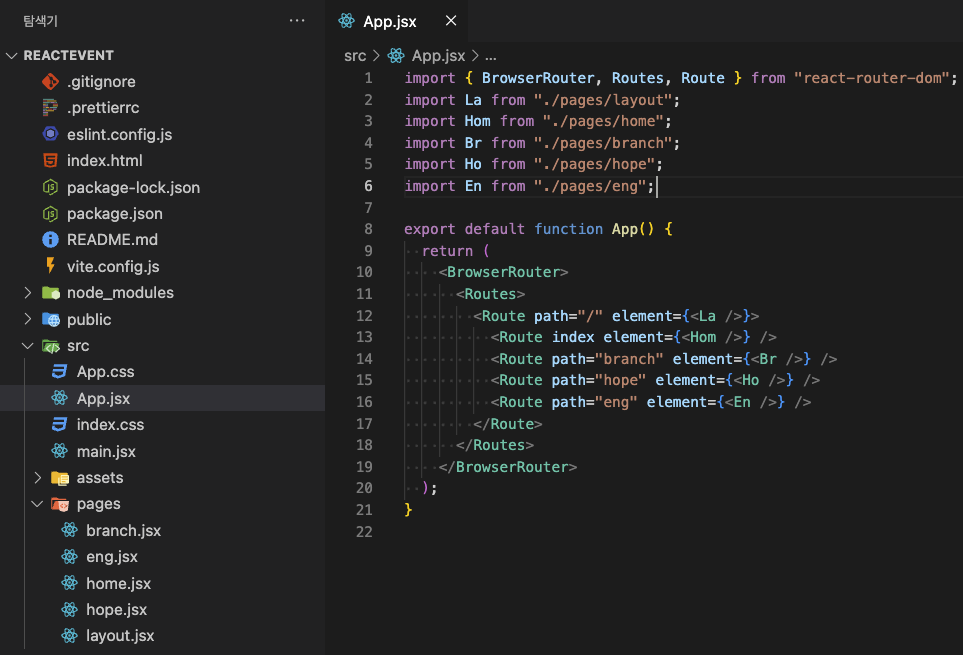

# `React Router`

### 리액트 라우터는 신규 페이지를 불러오지 않고, 각각의 url 에 따라 선택된 데이터를 하나의 페이지에서 렌더링 해주는 라이브러리와 같은 기능이다. Create React App에는 페이지 라우팅 기능이 포함되지 않았다. 리액트 라우터는 인기있는 솔루션이다.

# `Router 사용법`

## 설치

```js
사용중인 앱경로 > npm i -D react-router-dom
```



### 1. App.jsx

```js
import { BrowserRouter, Routes, Route } from "react-router-dom";
import La from "./pages/layout";
import Hom from "./pages/home";
import Br from "./pages/branch";
import Ho from "./pages/hope";
import En from "./pages/eng";

export default function App() {
  return (
    <BrowserRouter>
      <Routes>
        <Route path="/" element={<La />}>
          <Route index element={<Hom />} />
          <Route path="branch" element={<Br />} />
          <Route path="hope" element={<Ho />} />
          <Route path="eng" element={<En />} />
        </Route>
      </Routes>
    </BrowserRouter>
  );
}
```

### 2. layout

```js
import { Outlet, Link } from "react-router-dom";

const Layout = () => {
  return (
    <section>
      <nav>
        <ul id="menu">
          <li>
            <Link to="/">홈화면</Link>
          </li>
          <li>
            <Link to="/branch">가지에</Link>
          </li>
          <li>
            <Link to="/hope">희망의 말</Link>
          </li>
          <li>
            <Link to="/eng">새기어 놓고서</Link>
          </li>
        </ul>
      </nav>
      <Outlet />
    </section>
  );
};

export default Layout;
```

### 3. 신규 페이지 예시

```js
const Branch = () => {
  return <h1>가지에</h1>;
};

export default Branch;
```
