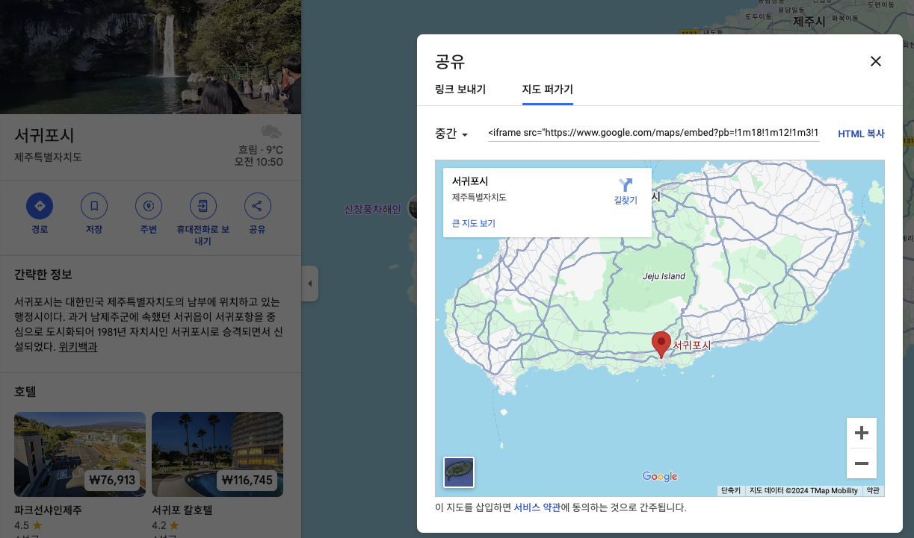

# 구글맵

### https://www.google.com/maps



```html
<!DOCTYPE html>
<html lang="en">
  <head>
    <meta charset="UTF-8" />
    <meta name="viewport" content="width=device-width, initial-scale=1.0" />
    <title>Document</title>
  </head>
  <body>
    <iframe
      src="https://www.google.com/maps/embed?pb=!1m18!1m12!1m3!1d213426.2407812199!2d126.39347384301712!3d33.29828698583987!2m3!1f0!2f0!3f0!3m2!1i1024!2i768!4f13.1!3m3!1m2!1s0x350c545193497877%3A0xc6016d3e5a3295c3!2z7KCc7KO87Yq567OE7J6Q7LmY64-EIOyEnOq3gO2PrOyLnA!5e0!3m2!1sko!2skr!4v1734659279228!5m2!1sko!2skr"
      width="600"
      height="450"
      style="border: 0"
      allowfullscreen=""
      loading="lazy"
      referrerpolicy="no-referrer-when-downgrade"
    ></iframe>
  </body>
</html>
```
