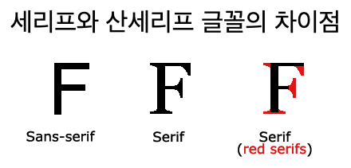

# 글꼴 페어링(어울리는 글자체 추천)

### https://www.w3schools.com/css/css_font_pairings.asp

```html
<!DOCTYPE html>
<html lang="en">
  <head>
    <meta charset="UTF-8" />
    <meta name="viewport" content="width=device-width, initial-scale=1.0" />
    <title>글꼴 가져오기</title>
    <style>
      @font-face {
        font-family: "Roboto", serif;
        src: url("./font/Roboto/Roboto-Bold.ttf") format("truetype");
        font-weight: bold;
        font-style: normal;
      }

      h1 {
        font-family: "Roboto", serif;
      }
    </style>
  </head>
  <body>
    <h1>가나다라마바사</h1>
  </body>
</html>
```
