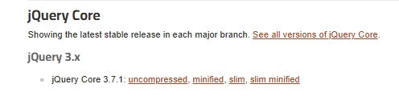
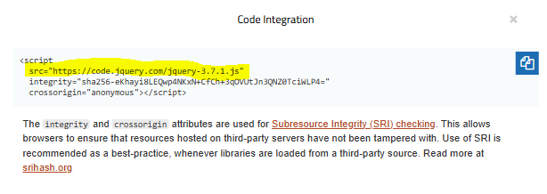

# # 제이쿼리
- 다운로드 https://jquery.com/download/ -> 프로젝트 파일에 다른이름 저장 -> script src 링크연결

### CDN 
- 제이쿼리 cdn 
- script 주소 연결
<br> 
- umcompressed : 전체 소스 (용량이 큼)
- minified ~ slim minified (용량이 작음)
<br> 

# 활용 예제1

```html
<!DOCTYPE html>
<html lang="en">
<head>
    <meta charset="UTF-8">
    <meta name="viewport" content="width=device-width, initial-scale=1.0">
    <title>Document</title>
    <!-- js 라이브러리 -->
    <script src="jquery-3.7.1.min.js"></script>
    <script src="https://code.jquery.com/jquery-3.7.1.js"></script>
</head>
<body>
    <h1 id="title">제이쿼리 배워보자</h1>
    <button id="btn">스타일 변경</button>
</body>

<script>
    // $(선택자).실행명령();
    $(document).ready(function(){
        $("#btn").click(function(){
            $("#title").css("color", "red").css("font-size", "30px")
        })
    })

</script>
</html>
```
<br>
<br>

# 활용 예제2
```html
<!DOCTYPE html>
<html lang="en">
<head>
    <meta charset="UTF-8">
    <meta name="viewport" content="width=device-width, initial-scale=1.0">
    <title>Document</title>
    <!-- js 라이브러리 -->
    <script src="jquery-3.7.1.min.js"></script>
    <script src="https://code.jquery.com/jquery-3.7.1.js"></script>
</head>
<body>
    <div class="profile">
        <h2 id="pname">홍길동</h2>
        <p id="pd">웹개발자</p>
    </div>
    <div class="ed-di">
        <input type="text" id="edinput" placeholder="이름수정...">
        <button id="ed-name">이름 수정</button>
    </div>
</body>

<script>
    $(document).ready(function(){
        $("#ed-name").click(function(){
            let edinput = $("#edinput").val();
            if(edinput.trim()){
                $("#pname").text(edinput)
            } else{
                alert("수정할 이름을 입력하세요.")
            }
        })
    })

    $("#edinput").keyup(function(){
        $("#pd").html(`<b>실시간 수정하고 있습니다. ${$(this).val()}`)
    })
</script>
</html>
```
