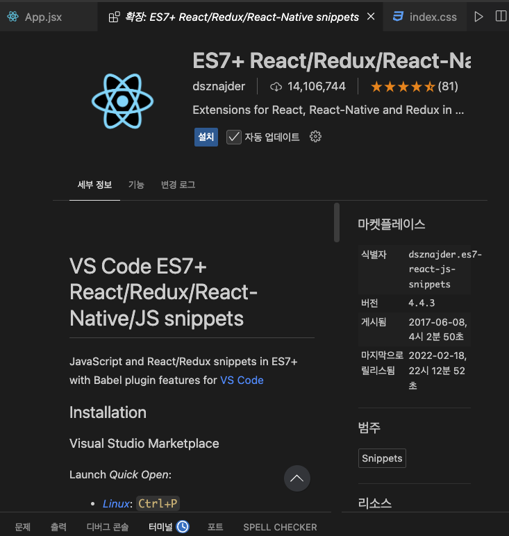

`scss`

1. 설치

<!--
sass 설치할때,
scss 확장자
 -->

```js
npm install sass
```

- scss는 변수를 선언 할 수 있다.

### main.scss 활용 예시

```scss
$main-color: skyblue;
$text-color: #333;
$background-color: pink;

body {
  color: $text-color;
  margin: 0;
  padding: 0;
}

.nav {
  background-color: $background-color;

  ul {
    list-style: none;
    display: flex;
    li {
      margin-right: 20px;
      a {
        text-decoration: none;
        color: $text-color;
      }
    }
  }
}
```

### 가져오기

```scss
import "../style/main.scss";
```

- dom
- html태그 명령을 react에서 자연스럽게 써주는것

2. 리액트 확장프로그램 설치

- 
- rafce 입력
