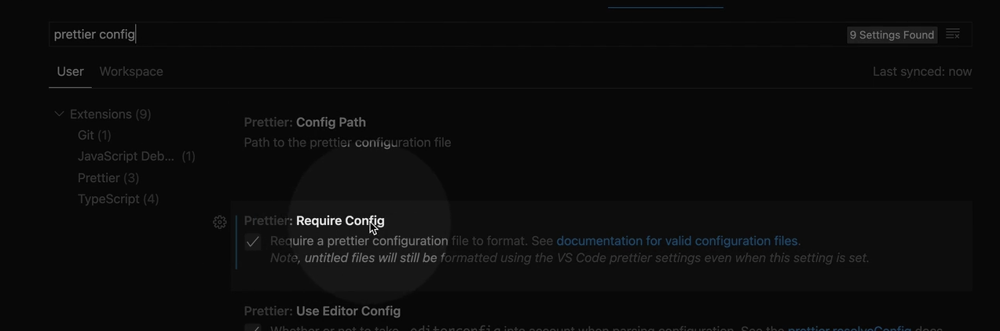

### .prettierrc

```js
{
  "semi": true,
  "singleQuote": false,
  "endOfLine": "lf",
  "tabWidth": 2,
  "useTabs": false
}
```

**"semi": true**

- **기능**: 코드 라인의 끝에 세미콜론(`;`)을 자동으로 추가합니다.

**"singleQuote": false**

- **기능**: 문자열을 감쌀 때 쌍따옴표(`""`)를 사용합니다.

**"endOfLine": "lf"**

- **기능**: 파일의 줄 끝 스타일을 `LF` (Line Feed)로 설정합니다. 유닉스 계열 시스템(Linux, macOS)에서 주로 사용합니다.

**"tabWidth": 2**

- **기능**: 들여쓰기에 사용할 스페이스의 수를 2칸으로 설정합니다.

**"useTabs": false**

- **기능**: 탭 대신 스페이스를 사용하여 들여쓰기를 합니다.

---

### 설치방법

### 1. 설치 Prettier


### 2. root에 .prettierrc 파일 추가


### 3. window: ctrl + , (setting 열기)

- foramt on save 검색, 저장을 할때 형식이 맞춰주기 위함
  
- prettier config 검색
  

### 4. 추가


```js
  "editor.defaultFormatter": "esbenp.prettier-vscode",
```

- 설정 들어가면 Open Settings 아이콘 클릭, 복사한 코드 추가
  

- root .prettierrc 파일에 코드 추가
  

```js
{
  "semi": false,
  "singleQuote": true,
  "endOfLine": "lf",
  "tabWidth": 2,
  "useTabs": false
}
```
