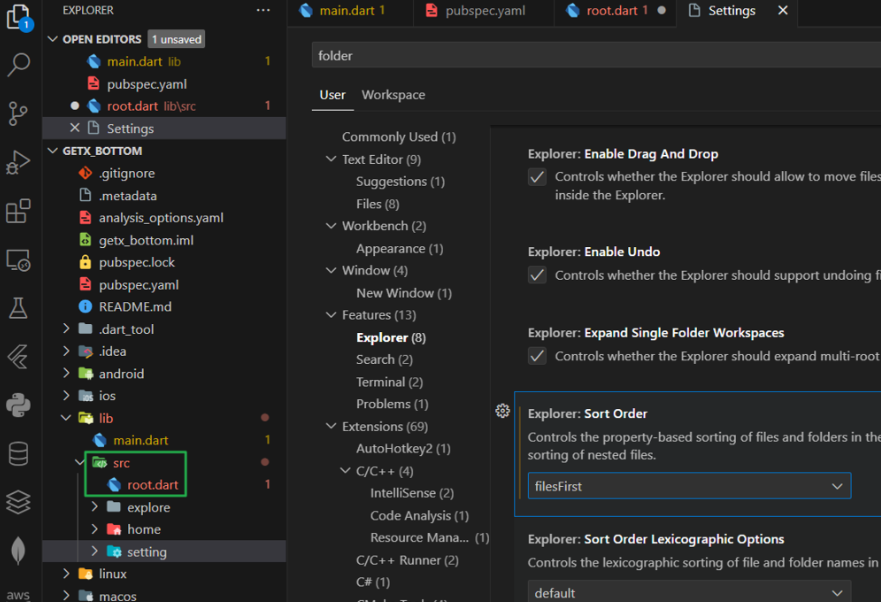
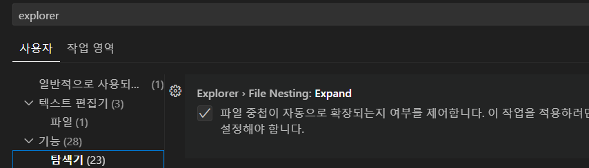
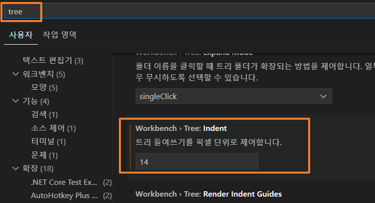
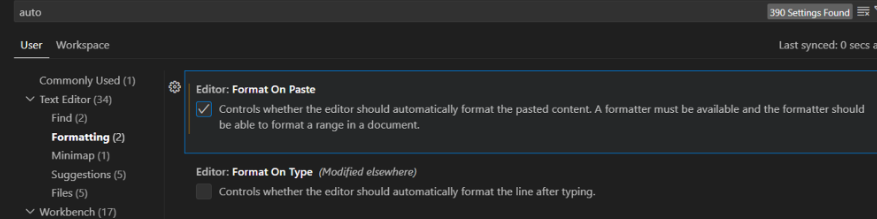

# vscode 파일구조(explorer) 세팅

### 설정 열기

- Window: Ctrl + ,

### 1. 폴더와 파일 정렬되는 순서 설정

- 논리적으로, 폴더 바로 아래 파일이 있게 설정하기 위함
  

- 설정 검색란에 folder 입력 Explorer에서 Sort Order를  'fileFirst'로 설정

---

### 2. 중첩폴더 만들지 않게 하기

- vscode는 파일구조화면이 너무 작아서 폴더 아래에 또 새로운 폴더를 만들 경우, 폴더간의 들여쓰기 칸이 너무 좁아 폴더들이 중첩되어 보인다. 이것을 없애기 위해 들여쓰기를 재설정

- FileNesting: Expand 를 체크해서, 폴더 아래에 자연스럽게 폴더가 생성

- 들여쓰기를 14로 넓게 잡아서 확실하게 파일의 계층구조가 한눈에 보이게 하기

---

### 3. 원본 그대로 붙여넣기 설정

- 코딩을 하다보면, 여러 줄을 한꺼번에 잘라내기해서, 어딘가에 붙여 넣을 경우가 종종 발생하는데,이상하게도, 원래 모양 들여쓰기 그대로 붙여지지 않고,항상 두번째 줄부터 앞으로 몇칸씩 앞으로 이동해서 붙여지게 된다. 그래서 매번 이것을 교정해 줘야 된다. 찾아보니,  역시 코딩하는 사람들은 조금이라도 불편한 것은 다 개선해놓았다. vscode에도 그 기능이 있으나 설정이 default로 안되어있다. auto 라고 검색하고, Formatting을 눌러보면,  Format on Paste 가 있는데, 이것을 체크하면 붙여넣기 될 때, 알맞은 포멧으로 자동으로 만들어주니, 결국 내가 붙인 모양 그대로 붙여지게 된다.

- 설정 auto 검색
- Formatting -> Format on Paste 체크
- 붙여넣기 될 때, 알맞은 포멧으로 자동으로 만들준다, 결국 내가 붙인 모양 그대로 붙여지게 된다.
