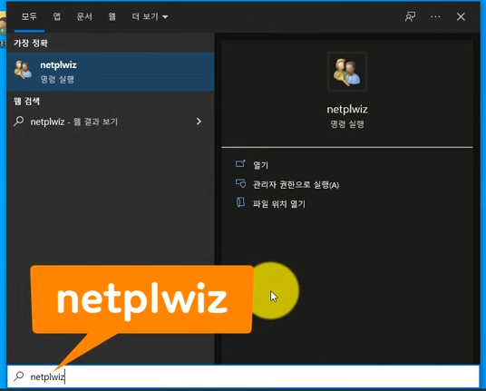
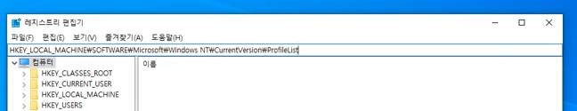

# `1. window 사용자 이름 바꾸기`

- netplwiz 검색
- 속성, 사용자이름, 전체이름 바꾸고자하는 영문이름으로 변경

# `2. 폴더명을 영문으로 변경방법`

### 1) Administrator 계정 활성화

- 단축키 window + x
- Windows PowerShell(관리자) 실행
- 어드민 계정 활성화: net user administrator /active:yes
- 창닫고, 단축키 window + x, 종료 또는 로그아웃 > 로그아웃

### 2) 사용자계정 폴더명으로 변경하기

- 단축키 window + x
- 컴퓨터 관리 클릭
- 로컬 사용자 및 클릭 > 사용자 > 이름을 변경할 계정 마우스 우측클릭 > 영문이름으로바꾸기
- 단축키 window + x > Windows PowerShell(관리자) 실행
- 리네임 명령어: ren C:\Users\예전한글이름 바꿀영문이름, 창닫기

### 3) 레지스트리 정보 변경하기

- 윈도우 찾기에서 레지스트리 편집기 검색

- 레지스트리 위치: HKEY_LOCAL_MACHINE\SOFTWARE\Microsoft\Windows NT\CurrentVersion\ProfileList
- 해당 위치에 있는 폴더들을 클릭해서 한글로 되어있던 계정명 찾기
- 찾으면 더블클릭 후 영문계정명으로 변경
